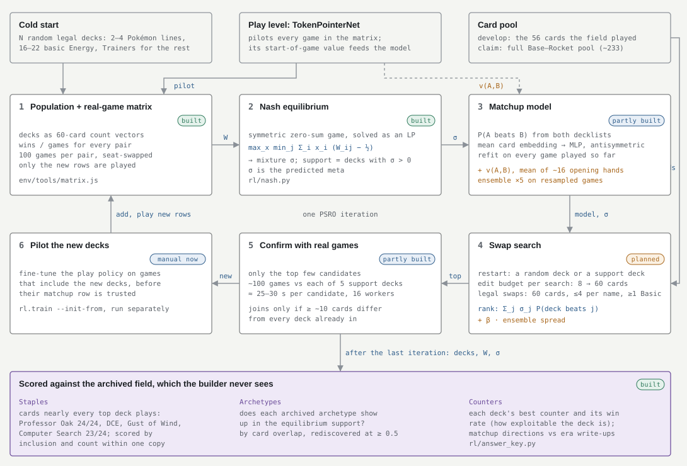

# Pokémon TCG metagame RL

A reinforcement-learning project on the Pokémon Trading Card Game. The environment is
[evcoats/ryuu-play](https://github.com/evcoats/ryuu-play) (branch `sts-2000-pool`), a fork of
[keeshii/ryuu-play](https://github.com/keeshii/ryuu-play), the open-source Pokémon TCG simulator
in TypeScript. The fork is included here as the `ryuu-play/` submodule.

**The goal:** give an agent only a card pool and the rules. It learns to play any deck, learns
to build the decks worth playing, and then is checked against a real historical tournament
metagame that it never saw.

The end target is a full **World Championships metagame**. The first target is deliberately
much smaller: the **July 2000 Super Trainer Showdown (California)**. It has a 56-card field
that is now fully implemented in the engine and verified. Every part of the system gets built
and proven there first.

## Status

<!-- status:start -->
*Updated 2026-10-06.*

**Where things stand.** A0, A1 and A3 are done; A2 has its ladder and the SimpleBot matchup
matrix. In A5, scoring candidate decks by the pilot's own value beat the other builder designs
([2000s result #1](results/2000s-result-1/)), and piloting every PSRO iteration made the first built
metagame to beat the archived field (60.7%), still Energy-heavy. Every builder sees decks through the
pilot: one trained on human lists is strong but biased, while one trained only on random decks is
calibrated and unbiased but too weak to tell good decks from bad, so a stronger human-free pilot comes
next ([analysis and plan](notes/analysis-2026-10-06.md)).

**Earlier work:**

- **Log #1 (A0, engine covers the field).** All 24 archived STS lists build and play on the
  fork, with 541 engine specs, 68/68 interaction tests and 22/23 rulings passing (T18 open,
  outside this field). The engine runs ~9 games/s per core with no detectable first-player bias.
- **Log #2–9 (A1.1–A1.6, plus the promos).** The environment was built and verified: the
  enumerator against an oracle on 10,000 games (0 mismatches over 1.65M checked decisions), the
  engine's speedups against the original store, all 2000 rulings (T18 fixed) and CI. Building it
  turned up engine faults — a Ditto Transform crash (fixed), prompt answers the engine never
  validates, and actions it accepts on the opponent's side — that the environment now guards
  against. All Base-era promos are in for the A5 full pool.
- **Log #10–16 (A1.6–A3).** The environment reached 68.7 random-policy games/s/core after a
  clone fix, and the A2 ladder is transitive (random < first-option < heuristic < SimpleBot);
  the first A3 run drifted into free start-then-cancel cycles, now removed from the action
  space. Two independent A3 reruns beat SimpleBot 97.9% ± 1.0 and 97.2% ± 1.6 in both deck
  directions, and the stronger (run c) beats the other 57.8%. The token model, central GPU
  inference and the A5 pieces (matchup model, edit builder, PSRO loop) are built and tested.

- **Log #17–24 (A2–A4.2, B1, A5 tooling).** A4.1, one MLP policy for all 24 decks, met its
  per-deck exit (re-scored: mirror 89.6%, field 88.5% vs SimpleBot) once two environment loops
  were fixed (Metronome copying Metronome; start-then-undo cycles), the loops behind every game
  its exit had cut off and the stall that the token-model run, now trainable at scale, exposed.
  Phase B moved to Worlds 2005 (San Diego) after a by-printing measurement showed 2011's card gap
  without 2011's missing mechanics. A three-tier answer key (staples, archetypes, counters) now
  scores any population against the archive, and on the SimpleBot matrix the equilibrium support
  is exactly the three decks hardest to counter.
- **Log #25–32 (A4.2, A5).** The token model, at a third of the MLP's parameters, beats
  SimpleBot 93.2-93.3% and A4.1 itself 66-68%, and a supervised check confirms it but shows it
  short of capacity; PSRO's matrix games moved to the GPU, 14x faster with identical results, and
  the builder is planned as PSRO with a value-aware matchup model. The first full cold start
  (a5-cold2) dropped Computer Search and Item Finder and never added Double Colorless Energy;
  card ablations show the pilot is better off with a basic Energy than with PlusPower, Bill,
  Computer Search, Item Finder or Gust, since 45% of its games end by deck-out (SimpleBot: 14%),
  which biases every A5 measurement made with it. After three machine crashes, every job is
  capped at 80% of GPU memory and 16 of 20 threads, with a GPU watchdog.

- **Log #33–40 (A5, A6).** With a pilot paid nothing for deck-out wins, the value-scored search
  beat real-game and matchup-model scoring ([2000s result #1](results/2000s-result-1/)) but flooded
  its deck with Energy, which the start-of-game value overrates, while a deck-strength model built
  on game statistics ranks decks well but searches too slowly to use alone. Closing the loop,
  piloting every PSRO iteration, gave the first built mixture to beat the archived field (60.7%),
  still at ~30 Energy and below Graham's list (68.1%). Jobs are capped at ~80% of the machine
  after three crashes.

**Recent (log #41–42):** Sampling deck choices (τ = 0.03) in the closed loop kept decks human-like
and the equilibrium diverse but weaker (33-43% against the field). A pilot trained only on random
decks, never on a human list, reaches 78.7% against SimpleBot on the archived decks (human-trained:
92.6%) and 67.3% on unseen random decks (55.5%), stalls less (19% deck-outs), and its value no longer
overrates Energy; but deck choice barely moves its results (2-point spread across log #36's variants,
against 18), so it gives the builder little signal yet.

The full record is in [`notes/progress-log.md`](notes/progress-log.md).

**Next:** (from [the 2026-10-06 analysis](notes/analysis-2026-10-06.md))

1. A stronger human-free pilot: batch league snapshots (collection grew from 7 s to 55 s an
   iteration), then a longer run with a larger token model, self-imitation and auxiliary heads;
   judged by how much deck choice moves its results.
2. Search safeguards: pessimistic acceptance (ensemble mean − κ·std), a trust region around
   real-tested decks, and the real-win-rate-vs-search-pressure curve.
3. A regret-curated deck curriculum for the pilot (PLR / ACCEL) in place of per-iteration piloting.
4. Response diversity with an adaptive weight (DPP gain, DvD) instead of temperature; α-Rank beside
   Nash.
5. Replication: two more seeds of result #1 and both closed loops.
6. The full card pool with an engine-bug detector; then B1 (Worlds 2005 lists, EX-set checks).
<!-- status:end -->

---

## The problem: three decisions stacked

| Level | Decision | Horizon | Learned by | Signal |
|---|---|---|---|---|
| **Move** | Which card, which target, which search pick | One prompt | Policy network over the legal candidates | Policy gradient and value from the game level |
| **Game** | How to pilot a fixed 60-card deck under hidden information | ~135 actions per game in this format | Self-play against a population of opponents | Win or loss |
| **Metagame** | Which deck to bring, given what everyone else brings | One tournament field | A deck-edit policy inside a PSRO loop | The matchup table produced by the game level |

Card metagames are non-transitive (rock–paper–scissors on top of raw power), so the target at
the top level is an **equilibrium mixture of decks, not one best deck**. The three levels are
coupled: play skill decides which decks look good, and the decks in the field decide which
play skills matter.

**Ground truth.** Archived tournament results are the answer key. The agent drafts its own meta
from random decks on the full card pool and never sees the archived lists; its meta is what it
knows about decks. An agent that lands on what humans actually played has shown something that
win rates against its own checkpoints cannot. Human metagames are not equilibria, so matching
meta *shares* is not the goal. The comparison has three tiers (`rl/answer_key.py`):

1. **Staples:** cards nearly every top deck plays, at near-fixed counts. In the 2000 field,
   Professor Oak is in 24 of 24 lists, and Double Colorless Energy, Gust of Wind and Computer
   Search in 23. These hardly depend on the opponent, so the agent's decks should agree even
   where the archetype mix differs. Scored by inclusion, and by count within one copy. Staples
   such as Gust of Wind and Energy Removal only earn their slot under a pilot that uses them
   well, so this tier also tests play.
2. **Archetypes:** does each archived archetype appear in the agent's equilibrium support, by
   card overlap with the archived lists?
3. **The meta:** the counter table (each deck's best counter, with its win rate and how
   exploitable the deck is) and matchup directions, checked against era write-ups.

---

## Why start in 2000

| | July 2000 STS (Base–Rocket) | Worlds 2005, San Diego (EX Ruby & Sapphire–EX Emerald) |
|---|---|---|
| Card pool in ryuu-play | **Complete**: every card in the field is implemented and verified | Partial: 3 of the 9 EX sets are in the engine (not yet verified); about 100 of the 139 card names in the season's archetype lists still need an implementation (see B1) |
| Distinct cards in the field | **56** (21 Pokémon, 26 Trainer, 9 Energy) | 139 card names across 19 archetype lists; nine EX sets plus POP Series 1 and promos in the format |
| Evolution | Three stacks in the whole field, max depth 2 | Deep lines, Rare Candy, many evolution engines |
| One player's full observation | **482 bits ≈ 60 bytes**; ~760–870 floats one-hot | Needs the scalable token representation |
| Recorded field | 24 top-8 lists across three age divisions | One archived list per archetype so far (ptcgarchive) and the four official 2005 World Championship decks; full top-cut lists not yet sourced |
| Mechanics | No abilities-era complexity, no EX/GX prize rules, no ACE SPEC | Poké-Powers and Poké-Bodies, Pokémon-ex (two Prizes), Dark Pokémon; all already in the engine. No ACE SPEC, no Lost Zone, no LEGENDs |

The 2000 format is small enough to iterate on in hours on one machine and real enough to have
an answer key. Its weakness is also clear: there is **one** recorded field, and it is
concentrated (Wigglytuff 10/24, Haymaker 7/24, 8 archetypes). It can answer "does the agent find
Wigglytuff and Haymaker?" well. It cannot validate a predicted distribution. That is why it is
the proving ground and not the end result.

**The rule for Phase A:** anything that must scale to Worlds (the token representation, the
deck-general policy, the PSRO loop, the evaluation protocol) gets proven on 2000 first, against
a simpler baseline it must match or beat.

---

## Plan

### Phase A — Proving ground: July 2000 STS California

#### A0. Engine covers the field — ✅ done

On the engine fork, branch `sts-2000-pool`:

- Fossil Ditto re-enabled, and its two open TODOs closed (copying passive Pokémon Powers, and
  offering copied in-play Powers). Mr. Mime's Invisible Wall and Muk's Toxic Gas now work
  through Ditto.
- A new Wizards Black Star Promos set with the two promos the field played: Mewtwo #3 and Mew #8.
- **Verification:**
  - All 24 archived decklists build and start a game.
  - 541 engine specs pass (25 new).
  - 68/68 targeted card-interaction tests pass.
  - 1,926 card-data field checks against pokemon-tcg-data, with 1 cosmetic mismatch.
  - 22/23 dated 2000-era rulings pass. The failure (T18, Mysterious Fossil as a starting Basic)
    doesn't affect this field.
- **Measured:**
  - The engine runs ~9 real games/s per core and scales near-linearly to 8 workers.
  - No first-player bias is detectable (seat A won 54.5% ± 5.8 over 288 mirror games).
  - SimpleBot, the bundled bot, costs ~30× the engine per move (0.6 games/s/core), so it is an
    evaluation floor, not a self-play opponent.

#### A1. Make the engine an RL environment — ✅ done

The engine was built for a websocket server, not for millions of headless games. It has no
legal-move enumerator: an illegal action throws, and the store restores a deep-cloned backup.

1. **Throughput fixes — ✅ done** (fork `888b385`).
   - Stop deep-cloning `state.logs` on every dispatch. It grew all game long, which made a game
     O(n²) in its length.
   - Cache the card order in `propagateEffect`, rebuilding it when a new card appears.
   - Measured **554 → 160 µs/action (3.5×), 18.7 → 64.6 engine-only games/s/core**, with the
     state identical to the old engine after every action over 300 seeded games
     (`notes/scripts/ryuu_engine_equivalence.js`).
2. **Legal-action enumerator — ✅ done** (`env/legal.js`). At every decision, list the candidate
   actions: play card, attach, evolve, retreat, use Power, attack, pass, and the options of
   every open prompt. Verify it against the engine: every enumerated action must be accepted,
   and a sampled non-enumerated action must be rejected. Verified against an exhaustive oracle
   (`env/oracle.js`) on every decision of 10,000 games: 0 mismatches.
3. **Observation encoder — ✅ done** (`env/encode.js`): 1,110 byte-exact features (12 slots ×
   54 plus hand, discards, unseen cards, counts) and 1,915 action ids. Hidden information stays
   hidden: the opponent's hand shows as a size, and prizes are unknown to both players.
4. **Environment API — ✅ done** (`env/env.js`): `reset(deckA, deckB, seed) → obs, legal` and
   `step(action)`. Seeded, so games replay exactly. Each worker process runs many games
   (`env/runner.js`).
5. **Training bridge — ✅ done.** *Decision:* rollouts in Node with ONNX inference
   (`env/rollout_worker.js`), training in PyTorch (`rl/train.py`), syncing weights each
   iteration.
6. **Housekeeping — ✅ done.**
   - Fix T18 (fork `fc4c8ec`, `Rules.fossilsAsStarters`).
   - Run the spec, interaction, rulings and decklist checks as CI (`.github/workflows/ci.yml`),
     plus the engine equivalence, env and enumerator checks.

**Exit:** a seeded, enumerated, encoded environment at ≥ 50 random-policy games/s/core, with
the enumerator verified on every action across ≥ 10k games. *Met: 0 mismatches over 10,000
games; 53.9 random-policy games/s/core (`env/tools/bench_env.js`).*

#### A2. Baselines and the evaluation ladder

- **Opponents:** random, a cheap heuristic bot, SimpleBot (floor), and a fixed-budget search
  bot as a relative scale.
- **Protocol:** every comparison is seat-swapped, with fixed decklists and confidence intervals.
  At 200 games the standard error is ~3.5 points.
- **Puzzles:** positions in this format with provable answers, such as lethal this turn,
  avoiding deck-out, and the right Energy Removal target.
- **Skill-ceiling baseline:** the full 24 × 24 matchup matrix and its Nash equilibrium **under
  SimpleBot**. This is the reference for how the discovered meta shifts as play improves.

#### A3. Game level, one matchup — ✅ done

PPO with a small self-play league, on the field's top two archetypes (Wigglytuff vs Haymaker),
using the identity-indexed encoding from A1.

**Exit:** beats SimpleBot by a clear, seat-swapped margin in both directions of the matchup, and
the result holds against held-out league checkpoints, not only its training opponents.

#### A4. Game level, every deck

1. **One deck-general policy**, conditioned on its own decklist and the opponent's, trained
   across all 24 archived lists.
2. **The scalable representation**, built here and required to match A4.1 before Phase B: card
   tokens, a verb head plus a pointer head over the legal candidates, and card embeddings built
   from card features and rules text.

**Exit:** beats SimpleBot with every deck; the trained-policy matchup matrix is stable across
reruns; and its matchup directions agree with era write-ups wherever those exist.

#### A5. Metagame level



*The loop as of log #28 ([full page](notes/schematics/metagame-builder.html)). Since log #34, step 4 in the code is the restart search of `rl/search.py` (`rl/psro.py --builder games|model|value`); the PPO edit policy remains as `--builder edit`.*

1. **Fixed population.** Nash over the trained-policy matrix of the 24 archived lists. Do
   Wigglytuff and Haymaker sit in the support? Compare against the SimpleBot equilibrium from A2.
2. **Deck builder: PSRO with a matchup model.** A deck population, its real-game matchup
   matrix and its Nash mixture. Each iteration:
   1. Solve Nash over the population's real-game matrix.
   2. Search card swaps (under the construction rules), ranked by the matchup model's predicted
      win rate against the Nash mixture, from several starting decks.
   3. Play real games for the top few candidates, add them to the population, refit the model.

   - **The matchup model** predicts P(A beats B) from both decks (mean of the token model's card
     embeddings, so unseen cards are covered) plus the pilot's value at the start of the game,
     v(A, B), averaged over ~16 opening hands (forward passes, no games). The value feature
     starts the model at the pilot's own judgment; it learns where the pilot is wrong, mostly on
     decks the pilot has not trained on. It is fitted on every real game played so far, and only
     ranks: every number that enters the matrix is from real games.
   - **Exploration**, by two mechanisms:
     - **Random restarts with varied edit budgets.** Each search starts from a fresh random
       legal deck or from a support deck, with a budget, drawn per search, on how many cards it
       may change: from 8 (refining a support deck) to 60 (a full rewrite). This decides where
       the search looks: many separate basins rather than one deck refined forever.
     - **Optimism under uncertainty.** The matchup model is a small ensemble (about 5, trained
       on resampled games), and candidates are ranked by mean + β × spread. Where the copies
       disagree is where the model has seen few games, so unusual decks get tried, and the bonus
       shrinks once their games are in. This decides which candidates get real games.
     - A new deck joins the population only if it differs from every existing deck by at least
       ~10 cards, so the population does not fill with near-copies.
   - **Is exploration working?** Cold starts from different seeds reach overlapping supports (by
     card overlap); new decks keep entering the support, and the share of the pool tried keeps
     growing; and the model's error on newly tested decks stays small. Disagreeing seeds with a
     stalled support mean explore more.
   - New decks get piloting time before their matchup row is trusted.
   - Left out unless plain search stops finding new support decks: an RL-trained edit policy,
     MAP-Elites, a rectified-Nash solver, exploiter episodes.
3. **Two pool sizes.** Develop on the 56 cards the field played, which leaks human card choice
   but is cheap. Make the actual claim on the **full legal Base–Rocket pool** (all legal promos
   are now in: Wizards Black Star Promos #1–#16, fork `64330a4`). Most of those ~233 cards are
   unexercised by tests, so a cold-start builder will find engine bugs and treat them as
   strategies; expand verification first.
4. **Counters.** For every deck in the agent's population, its best counter and that counter's
   win rate (the deck's exploitability), from the matchup matrix. Then a counter-deck search:
   the builder aimed at one opponent deck instead of the meta mixture, over the whole pool, with
   the matchup model proposing and real games confirming. It answers "what beats X best?",
   possibly with a deck no one played. The archived decks are also scored as held-out entries
   against the agent's equilibrium: how would each human list have fared in the agent's meta?

**Exit:** from a cold start on the full pool, scored with the three-tier answer key: the agent's
mixture plays the field's staples at near-field counts, archived archetypes appear in the
equilibrium support (by card overlap), and the counters and matchup directions agree with era
write-ups where those exist. The result replicates across seeds. The three age divisions serve as
rough replicates of the human field.

#### A6. Play knowledge feeds deck building

- Measure what the play network's start-of-game value adds to the matchup model (A5.2): the
  model with and without it, scored by prediction error on newly tested decks, and the value
  alone as the ranking.
- Reuse the play encoder's card-interaction weights to score candidate cards.

**Phase A exit gate**, all required before starting Worlds work in earnest:

- The token-pointer policy matches the identity-indexed one.
- Cold-start rediscovery succeeds on the full pool.
- The evaluation protocol and environment run unattended.

---

### Phase B — Full Worlds metagame

Phase B reuses everything from Phase A. What is new is the card pool, the scale, and the data.

#### B1. Target: Worlds 2005, San Diego

The 2005 World Championships (San Diego, August 19–21, 2005) were played in the Modified format:
EX Ruby & Sapphire, Sandstorm, Dragon, Team Magma vs Team Aqua, Hidden Legends, FireRed &
LeafGreen, Team Rocket Returns, Deoxys and Emerald, plus POP Series 1, the EX Trainer Kits and
Nintendo Black Star Promos 1–27. Wizards' four 2005 World Championship decks reproduce top
players' lists: Queendom (Jeremy Maron), Dark Tyranitar (Takashi Yoneda, a finalist), King of the
West (Michael Gonzalez) and Bright Aura (Curran Hill).

Chosen by measurement over Worlds 2011 (San Diego) and 2013–14. The card gap is about the same as
2011's, and 2005 needs no new engine mechanics.

- **Coverage, measured** (`notes/scripts/ryuu_coverage_season.py`, results in
  `notes/data/eval/coverage_2005.json` and `coverage_2011.json`; every card resolved to its
  printing through pokemon-tcg-data):

  | | 2005 | 2011 |
  |---|---|---|
  | Archetype lists (ptcgarchive) | 19 lists, 139 names | 13 lists, 111 names |
  | Names still to implement | ~100 (72%) | ~79 (71%) |
  | Copies buildable today | 362 of 1,140, +65 near-reprints to check | 334 of 780 |
  | Closest list | Zapdos/Moltres "Birds" 40/60 | Reshiram/Typhlosion 42/60 |
  | Full legal pool | 3 of 9 EX sets present, ~600 cards to go | ~35 cards of 6 sets present, ~600 to go |
  | New engine mechanics | none | Lost Zone, LEGEND cards |

  No list in either season is fully buildable yet. The most-played missing 2005 cards are
  Supporters and Trainers from the missing sets (TV Reporter, Steven's Advice, Rocket's Admin.,
  Swoop! Teleporter), Jirachi (Deoxys) and the Team Rocket Returns Dark Pokémon. "Different"
  (same name, different card) slightly over-counts, since a few are wording-only changes.
- **The engine's EX sets:** Ruby & Sapphire, Sandstorm and FireRed & LeafGreen are
  near-complete (about 109, 98 and 112 cards) but not yet checked against card data and
  rulings as the 2000 pool was.
- **2013–14, for comparison:** two archived Worlds Blastoise/Keldeo lists build 57 of 60 cards,
  but all of Team Plasma and Black Kyurem-EX are missing (`notes/tcg-rl-research-notes.md`).
- **Data:** the season's archetype lists (ptcgarchive, saved in
  `notes/data/2005-season-ptcgarchive/`) and the World Championship decks. Full Worlds 2005
  top-cut lists and placements are still to be sourced.
- **Legality:** build the 2005 legal pool from set codes. The current pool mixes sets that never
  coexisted, and an agent would invent decks no one could have played.

#### B2. Close the card gap with the Phase A verification pipeline

For every new card: card-data checks against pokemon-tcg-data, dated rulings tests, targeted
interaction tests, and every archived Worlds list as a regression deck.

#### B3. Scale

- The token representation carries over unchanged.
- Re-profile the engine on the larger pool and rerun the throughput budget before sizing PSRO.
  At 200 games per pair, one new row in a 40-deck population costs ~8,000 games.

#### B4. Game level, then metagame level on the Worlds pool

Same exit criteria as A4 and A5, measured against the archived Worlds top cut.

#### B5. Human evaluation

- Run the agent on a ryuu-play server against players who know the era (TCG ONE's Legacy format
  covers this pool).
- Use fixed archived lists, seat-swapped, ~200 games per opponent pool.
- The defensible claim is "beats experienced players on fixed lists within this pool."

---

## Risks

- **Play skill and the meta are coupled.** A weak pilot undervalues setup decks. Which
  archetypes appear as play improves is tracked as a result in its own right.
- **Engine bugs become meta bugs.** Archived lists double as regression decks, and the builder
  is only let loose on cards with test coverage.
- **One field in 2000.** The STS gives a single 24-deck field (STS New Jersey is a Gym-era format
  needing two unimplemented sets, 0/24 buildable). Phase A success means yes/no rediscovery,
  not distribution matching.
- **Human metas are not equilibria.** Rediscovery is the comparison; share percentages are not.
- **Worlds coverage.** "From scratch" claims in Phase B hold only for the buildable pool until
  B2 closes the gaps.

---

## Repository

| Path | Contents |
|---|---|
| `ryuu-play/` | Submodule: the engine fork, pinned to a commit on `sts-2000-pool`. Engine changes are committed there and the pin is bumped here. |
| `notes/progress-log.md` | Append-only log of finished todos, from which the Status section is summarized |
| `notes/analysis-2026-10-06.md` | Analysis of logs #30-42 with a literature survey and the ranked next steps |
| `results/` | Headline results, one folder each with a README, data and the scripts to reproduce them ([index](results/README.md)); [2000s result #1](results/2000s-result-1/) is the A5.2 builder comparison |
| `notes/schematics/` | Diagrams of the system, as standalone HTML pages: `metagame-builder.html` (and the `.svg` shown under A5) is the A5 PSRO loop, marked built vs planned |
| `env/` | The RL environment: seeded game loop, legal-action enumerator and its oracle, encoder, env API, rollout runner and workers; `env/tools/` has the verification, test, benchmark and evaluation scripts |
| `rl/` | The learner: PyTorch models, ONNX export, rollout reader, PPO training (`python -m rl.train`) |
| `notes/tcg-rl-research-notes.md` | The research log and RL design, including the comparison with [Pokemon_TCG_RL](https://github.com/SuryaSGit/Pokemon_TCG_RL) (v4) |
| `notes/three-level-rl-pitch.md` | The three-level (move / game / metagame) pitch |
| `notes/sts-2000-engine-check.md` | The 2000 verification report: coverage, throughput, profiling, state vector |
| `notes/data/` | The archived STS decklists (scraped from ptcgarchive.com), aggregated to CSV and JSON |
| `notes/scripts/` | Harness, verification and measurement scripts (Node for the engine, Python for scraping and card-data checks) |

`notes/data/cache/` (raw scraped pages and the pokemon-tcg-data download) is not committed;
`meta_aggregate.py` and `ryuu_card_data_check.py` rebuild it on first run. The three
`*_v4.py` / `dims_v5.py` probes expect a local Pokemon_TCG_RL checkout at a hard-coded path.

### Setup

Requires Node.js 18.19+ (developed on Node 24).

```
git clone --recurse-submodules https://github.com/AI-Alignment-UIUC/metagame-rl
cd metagame-rl/ryuu-play
npm install --workspace=packages/common --workspace=packages/sets --workspace=packages/simple-bot
npm run compile -w packages/common && npm run compile -w packages/sets
(cd packages/sets && npx jasmine-ts "tests/**/*.spec.ts")      # 541 engine specs
cd ..
node notes/scripts/ryuu_sts_decks_check.js        # 24/24 archived decks build and start
node notes/scripts/ryuu_rulings_tests.js          # 22/23 (T18 open)
```

The scripts find the engine at `ryuu-play/` by default; pass a path or set `RYUU_PLAY` to
point them elsewhere.

The environment and training (from the repository root):

```
npm install                                        # onnxruntime-node for the rollout workers
node env/tools/test_env.js                         # env API and encoder
node env/tools/verify_enumerator.js --games 200    # enumerator vs. the oracle
node env/tools/bench_env.js                        # random-policy games/s on one core
node env/tools/evaluate.js --x simplebot --y random --games 200
py -3 -m venv .venv && .venv/Scripts/pip install torch numpy onnx   # (CUDA build of torch from download.pytorch.org)
.venv/Scripts/python -m rl.train --run runs/try --matchup "Wigglytuff|Haymaker" --both-directions
```

## Credits

The engine and the ~900 card implementations are by keeshii and the ryuu-play contributors
(MIT). Card data was checked against
[PokemonTCG/pokemon-tcg-data](https://github.com/PokemonTCG/pokemon-tcg-data). Tournament data
is from [ptcgarchive.com](https://ptcgarchive.com/).
